# OpenRooms_RAW_loader

A dataloader and visualizer for OpenRooms modalities. Given one scene of multi-view observation, the following modalities are supported:
- 2D Per-pixel Properties:
  - **geometry** # from OptixRenderer & Mitsuba 3 renderer: images/demo_mitsuba_ret_depth_normals_2D.png
    - *depth map*
    - *normals*
  - **Microfacet BRDF**
    - *roughness map*
    - *albedo map*
  - **per-pixel lighting**
    - incoming radiance as envmaps (8x16)
    - incoming radiance approximated using Spherical Gaussian (SG) mixture
- Per-frame Properties:
  - **camera poses**
- Full 3D Properties:
  - **per-object**
    - *semantic label*
    - *triangle mesh*
    - *emitter properties* (for lamps and windows only)
      - intensity
      - (windows) SGs approximation of directional lighting # see Li et al. - 2022 - Physically-Based Editing of Indoor Scene Lighting... -> Sec. 3.1
  - **global environment map** (outdoor lighting)
  - **NeRF-related**
    - *camera rays* for all viewpoints and all pixels
    - ground truth 3D scene and differentiable rendering via Mitsuba 3:
      - *camera-ray-scene intersections* (surface points, ray travel length $t$, surface normals)

# Dependencies

``` bash
conda create --name or-py38 python=3.8 pip
conda activate or-py38
pip install torch torchvision torchaudio --extra-index-url https://download.pytorch.org/whl/cu113 # not tested with other versions of PyTorch
pip install -r requirements.txt
```

Hopefully that was everything. 
## Mitsuba 3 based inference, and notes on installation on ARM64 Mac
On Mac, make sure you are using a arm64 Python binary, installed with arm64 conda for example. Check your python binary type via:

``` bash
file /Users/jerrypiglet/miniconda3/envs/dvgo-py38/bin/python
```

Then install llvm via:

``` bash
brew install llvm
```
For Pytorch on M1 Mac, follow https://towardsdatascience.com/installing-pytorch-on-apple-m1-chip-with-gpu-acceleration-3351dc44d67c


# Dataset structure

- {OR_RAW_ROOT} # assets for OpenRooms; for access, request from Zhengqin Li or Rui Zhu
  - layoutMesh # mesh files for room layout (i.e. walls, ceiling and floor)
  - uv_mapped # shape files from ShapeNet
  - EnvDataset # outdoor envmaps

- data
  - intrinsic.txt
  - colors
  - semanticLabelName_OR42.txt
  - openrooms_public_re_2
    - scenes
      - xml1
        - scene0552_00_more
          - cam.txt # camera poses where rows are origin, lookat, up
          - main.xml # the scene XML file
    - main_xml1 # renderings
      - scene0552_00_more
        - im_%d.png/im_%d.hdr # RGB (PNG is only for reference; scales may be inconsistent)
        - imdepth_%d.dat # depth maps
        - imnormal_%d.png # normals in 2D
        - imroughness_%d.png # roughness in 2D
        - imbaseColor_%d.png # albedo in 2D
        - light_%d # per-frame emitter source info; should not be useful
          - ...
        - box{light_id}.dat # emitter info in 3D
        - imcadmatobj_%d.dat # instance/material segmentation in 2D
        - imenv_%d.hdr # per-pixel lighting envmaps in 2D

# Notes on coordinate systems
This will help clarifying the usage of camera poses ([$R$|$t$] for **camera-to-world** transformation) and camera intrinsics.

The camera coordinates is in OpenCV convention (right-down-forward). The loaded GT normal maps are in OpenGL convention (right-up-backward). See openroomsScene2D._fuse_3D_geometry(): normal<->normal_global
# Usage
## 2D dataloader and visualizer

``` bash
python test_class_openroomsScene2D.py --vis_2d True
```

This will load per-pixel modalities in 2D, and visualize them in a Matplotlib plot like this:


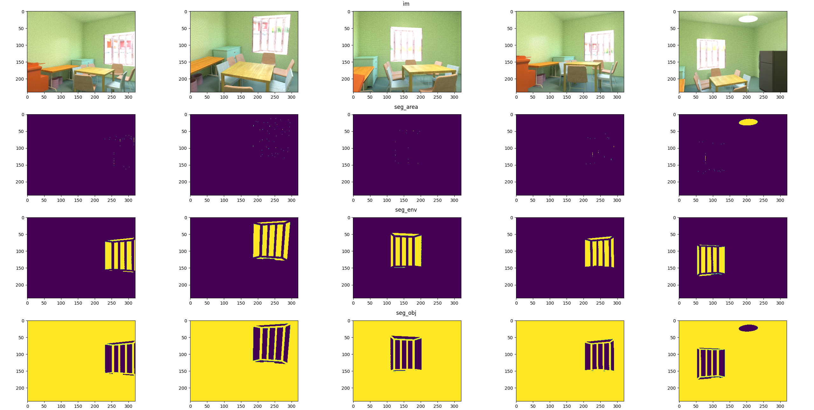

Supported modalities (all in pixel/camera space): 
- depth
- normal # camera coordinates in OpenGL convention (right-up-backward)
- albedo
- roughness
- seg_area # emitter: area lights (i.e. lamps): images/demo_segs_2D.png
- seg_env # emitter: windows shine-through areas: images/demo_segs_2D.png
- seg_obj # non-emitter objects: images/demo_segs_2D.png
- matseg # images/demo_semseg_matseg_2D.png
- semseg # images/demo_semseg_matseg_2D.png

## 3D dataloader and visualizer

Note that there are two visualizer implemented: based on Matplotlib and Open3D respectively.

### Matplotlib viewer

The Matplotlib visualizer supports basic visualization of 3D properties inclucing bounding boxes and camera axes, but not meshes. 

Use ``--vis_3d_plt True`` to use the Matplotlib visualizer. The result is something like this:

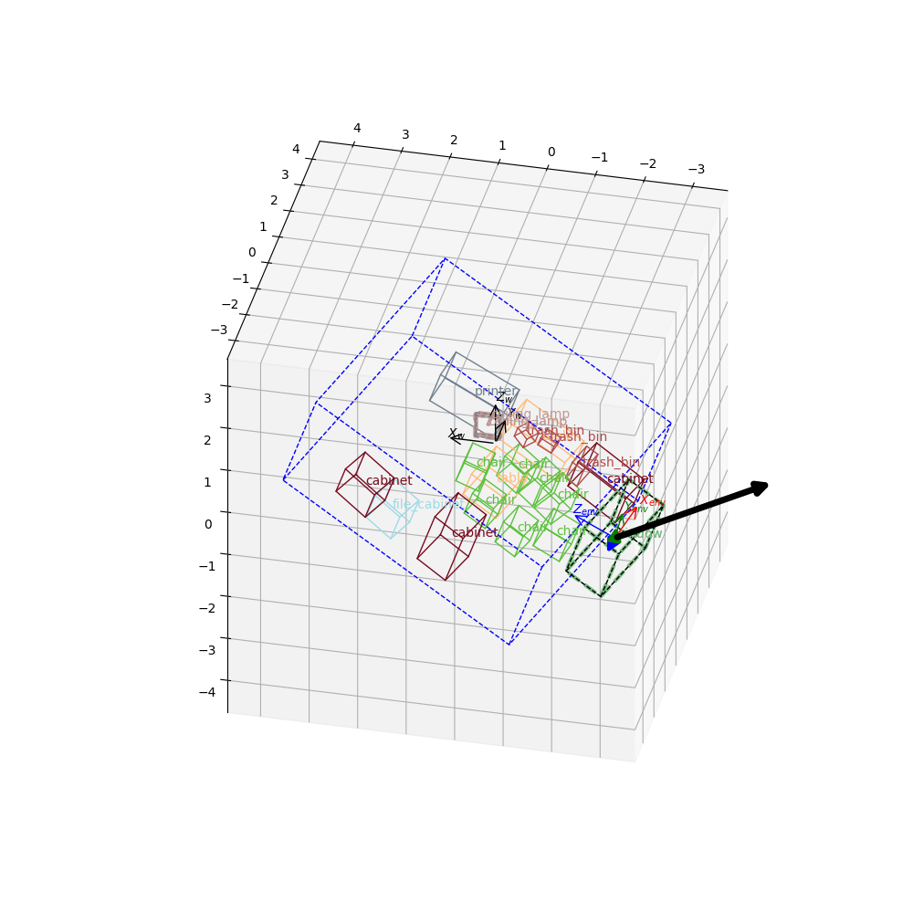

The Open3D visualizer is based on Open3D, supporting meshes and more beautiful visualization. If you are on a remote machine, make sure you have a X serssion with OpenGL supported (tested with TurboVNC on Ubuntu 18). Alternatively it is recommended to run everything locally (tested on Mac and Window), with the data transferred to your local device.

**Supported modalities:** (all in global coordinates, see $X_w$-$Y_w$-$Z_w$): 

- layout # walls, ceiling and floor, as bounding box or mesh
- shapes # boxes and labels (no meshes in plt visualization)
- emitters # emitter properties (e.g. SGs approximation for windows)
- emitter_envs # emitter envmaps for (1) global envmap (2) half envmap & SG envmap of each window

Also, results from differentiable rendering by Mitsuba 3:

- mi_depth_normal # same format as depth & normal from OptixRenderer
- mi_seg # same format as seg_area, seg_env, seg_obj from OptixRenderer

Comparing depth, normal maps, and segs from mitsuba sampling VS OptixRenderer: **mitsuba does no anti-aliasing**.

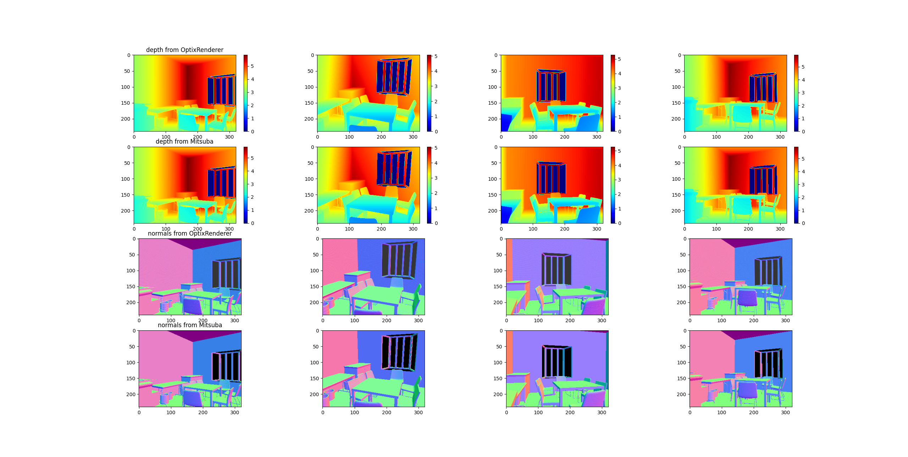
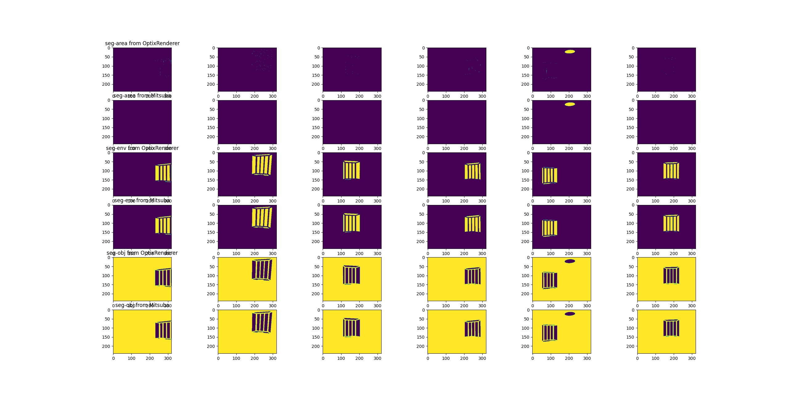

### Open3D viewer
```bash
python test_class_openroomsScene3D.py --vis_3d_o3d True
```

See the help info of the argparse arguments and comments for usage of flags.

Use ``--vis_3d_o3d True`` to use the Open3D visualizer. The result is something like this:


**Supported modalities:** 

- dense_geo # point clouds, normals, and RGB, fused from OptixRenderer renderings
- cameras # frustums
- lighting_SG # as arrows emitted from surface points
- layout # as bbox
- shapes # bbox and meshs of shapes (objs + emitters)
- emitters # emitter properties (e.g. SGs, half envmaps)
- mi # Mitsuba sampled rays, pts, normals, acquired via Mitsuba ray-scene intersections (more accurate with no floating points)

Examples:

dense_geo:
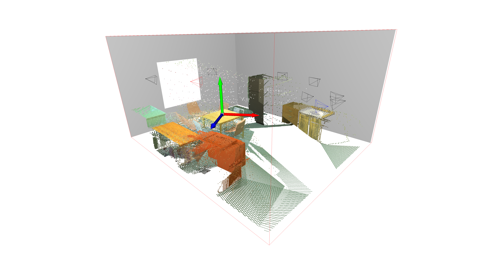

lighting_SG:
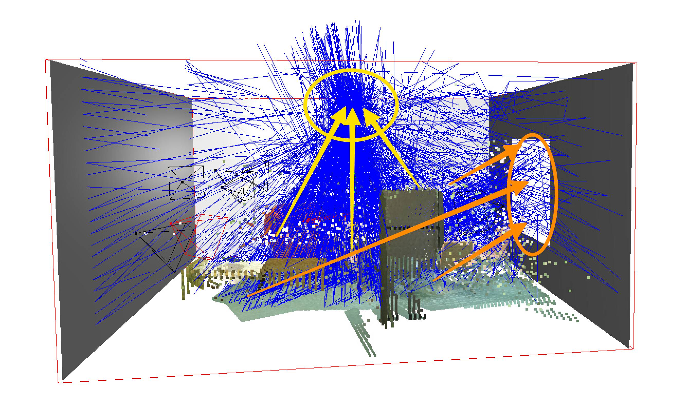

shapes:
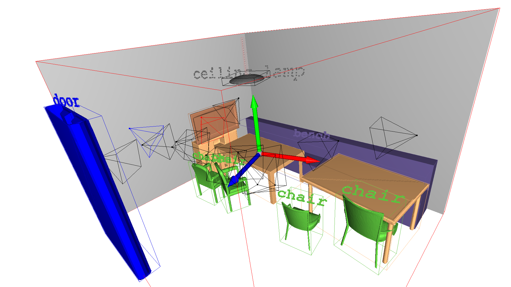

mi:
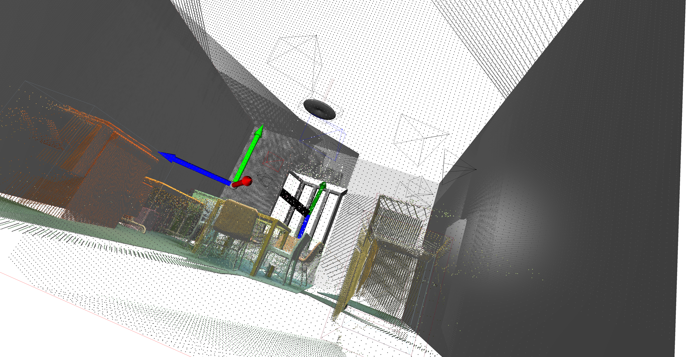
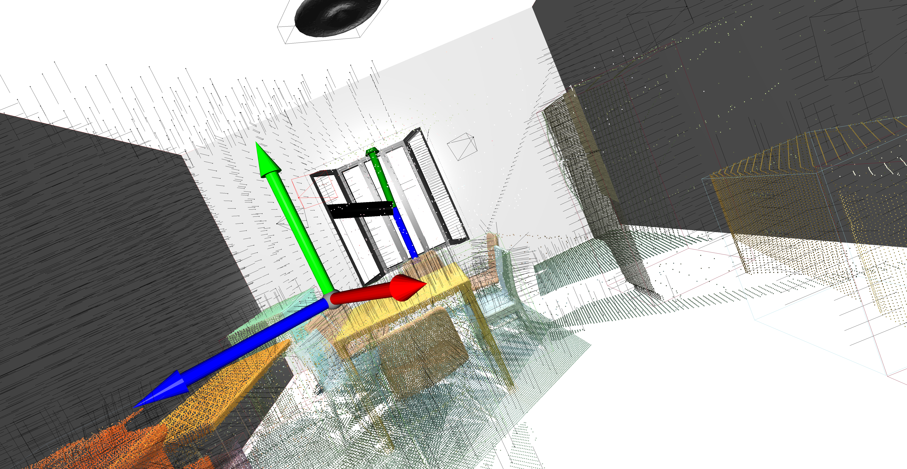
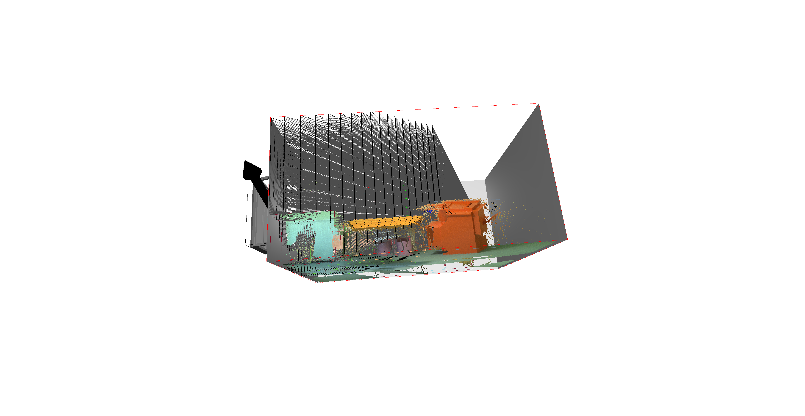

**Shader options**

Set ``--pcd_color_mode`` to one of 'rgb' (default), 'normal', etc., to colorize point cloud. Meanwhile set ``--if_shader=False`` so that the colors are free from Open3D shader, and visualizer runs much faster.

For example, colorize points with 3D normals:


``` bash
python test_class_openroomsScene3D.py --vis_o3d True --pcd_color_mode normal --if_shader=False
```

Or with visibility to emitter_0 (`--pcd_color_mode mi_visibility_emitter0 --if_shader=False`):

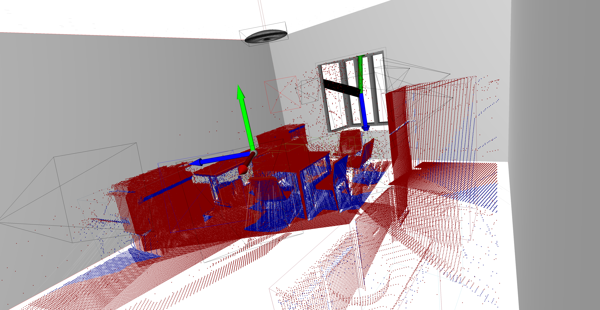

## 3D differentiable renderer

Supported 3D differentiable renderers (using GT labels):
- Full lighting renderers from ground truth lighting
  - `ZQ`: Zhengqin's surface renderer (*Li et al., 2020, Inverse Rendering for Complex Indoor Scenes*)
  - `PhySG`: PhySG surface renderer (*Zhang et al., 2021, PhySG*)
- Direct-lighting-only renderer, via importance sampling on emitter surface
  - `ZQ_emitter`: Zhengqin's emitter-based direct lighting renderer (*Li et al., 2022, Physically-Based Editing...*)

### Full lighting renderers from ground truth lighting
PhySG:
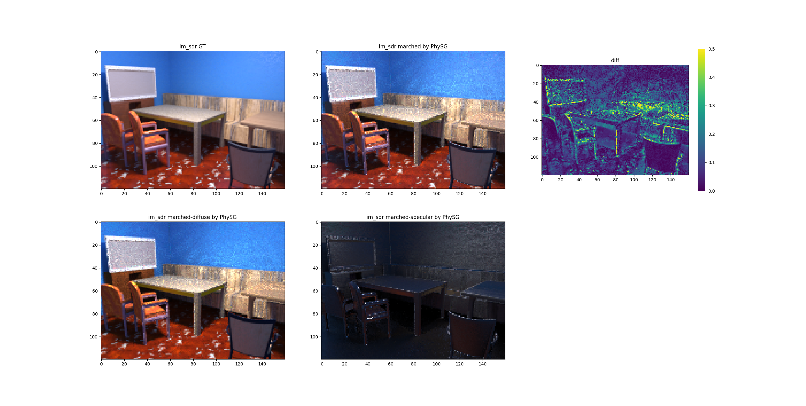
ZQ:
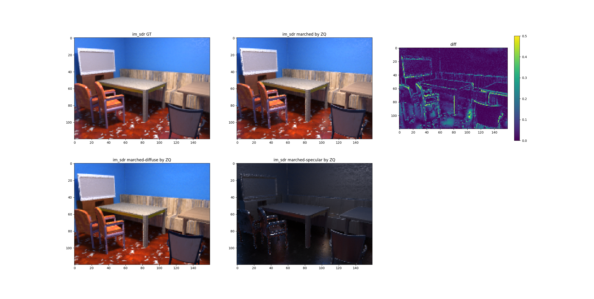

``` bash
PYTORCH_ENABLE_MPS_FALLBACK=1 python test_class_openroomsScene3D.py --vis_3d_o3d False --render_3d True
```

To render with **direct lighting only** using direct lighting ground truth (envmap/SGs), set `'if_direct_lighting': True`. Comparisons:

PhySG:
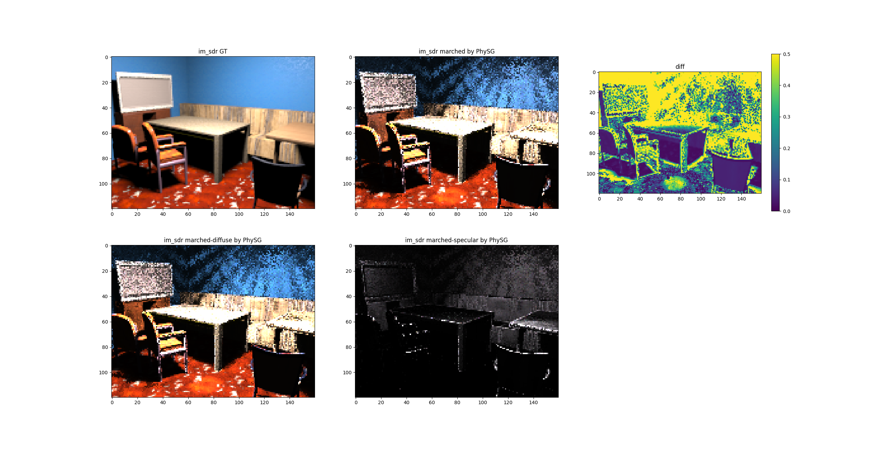

ZQ:
****

### Direct-lighting-only renderer
To render with Zhengqin's emitter-based direct lighting renderer, 

``` bash
PYTORCH_ENABLE_MPS_FALLBACK=1 python test_class_openroomsScene3D.py --vis_3d_o3d False --render_3d True --renderer_option **ZQ_emitter** --pcd_color_mode_mi input
```

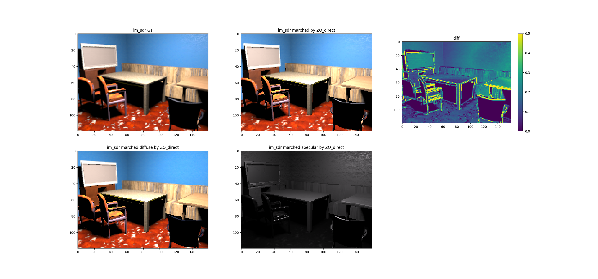

set ``--vis_3d_o3d True --if_set_pcd_color_mi True`` to visualize the Mistuba points colorized by either scene-lamp ray $t$ or $visibility$ (images/demo_mitsuba_ret_pts_pcd-color-mode-mi_renderer-t.png or images/demo_mitsuba_ret_pts_pcd-color-mode-mi_renderer-visibility-any.png). And set `mi_params['if_cam_rays']=True` to visualize scene-lamp rays.

Visualize scene-lamp rays for one scene point ``--if_add_rays_from_renderer True``:
``` bash

```
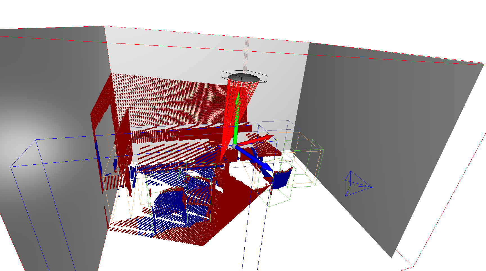
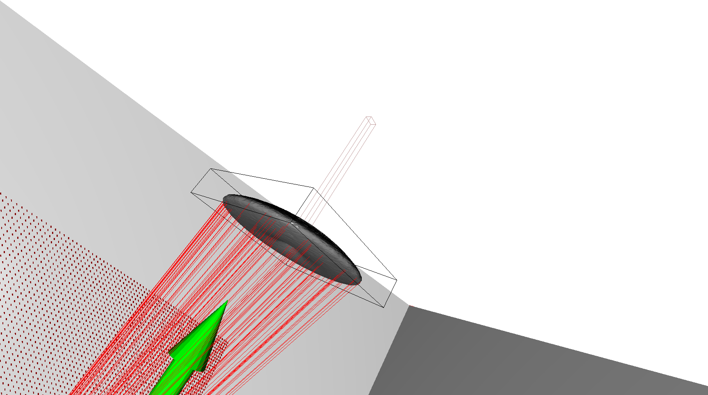
# Todolist
- [ ] **Interactive mode**: map keys to load/offload modalities on-the-go without having to change the flags and restart the viewer
- [ ] **Mitsuba scene**: enabling emitters and materials -> differentiable RGB rendering 