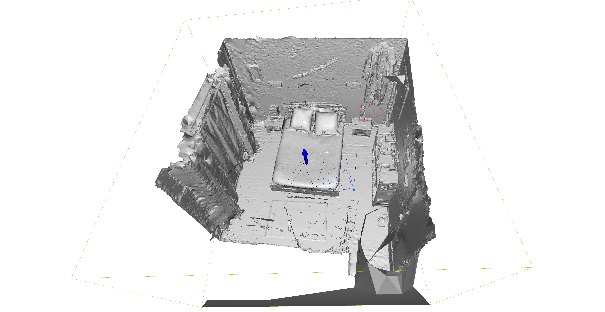
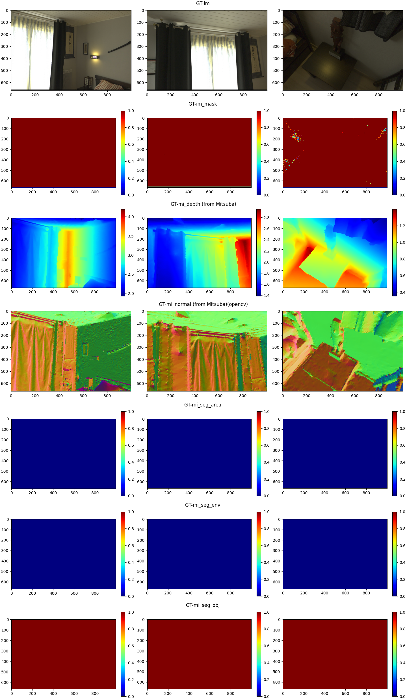
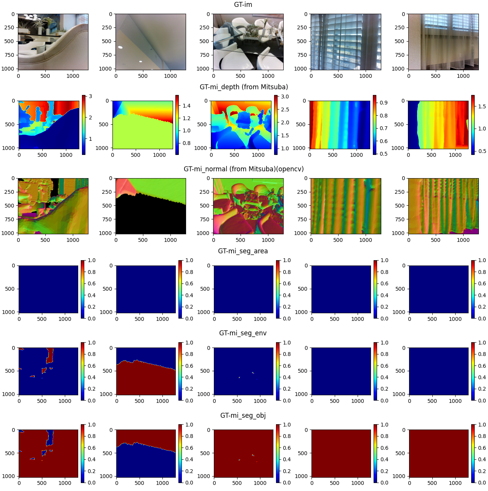
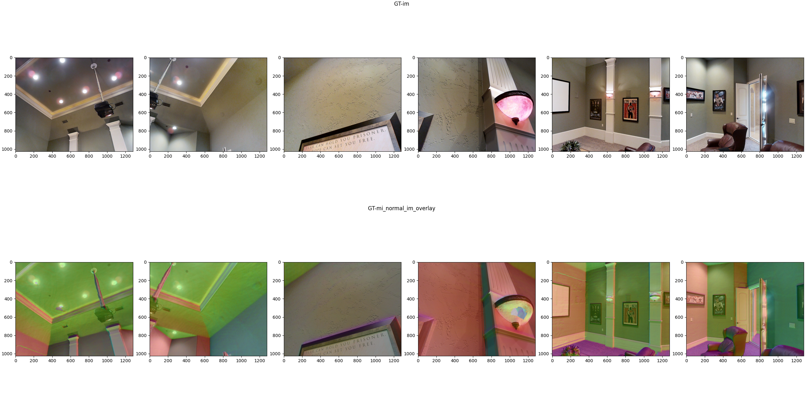

<!--ts-->
- [More datasets](#more-datasets)
  - [Free-viewpoint (fvp)](#free-viewpoint-fvp)
  - [Matterport3D (mp)](#matterport3d-mp)
  - [Replica](#replica)
  - [Real datasets of our capture](#real-datasets-of-our-capture)
    - [Convert to .exr files from RAW HDR brackets](#convert-to-exr-files-from-raw-hdr-brackets)
    - [dump to MonoSDF for geometry](#dump-to-monosdf-for-geometry)
    - [dump to Mitsuba format for inverse rendering](#dump-to-mitsuba-format-for-inverse-rendering)
  - [Other datasets](#other-datasets)
    - [Mitsuba](#mitsuba)

<!-- Created by https://github.com/ekalinin/github-markdown-toc -->
<!-- Added by: jerrypiglet, at: Mon Feb 13 02:05:56 PST 2023 -->

<!--te-->

# More datasets

- data
  - real
  - Matterport3D
    - 17DRP5sb8fy (house id)
        - undistorted_normal_images
        - sens
        - matterport_depth_images
        - undistorted_depth_images
        - matterport_color_images
        - poisson_meshes
        - matterport_hdr_images
        - undistorted_color_images
        - matterport_camera_poses
        - image_overlap_data
        - region_segmentations
        - house_segmentations
        - matterport_skybox_images
        - matterport_mesh
        - undistorted_camera_parameters
        - cameras
  - free-viewpoint
      - asianRoom1
          - images
          - meshes
          - cameras
          - lightings
          - testPath.lookat
          - mi_seg_emitter
          - scene_metadata_jpg.txt
          - scene_metadata.txt
          - scale.txt
      - asianRoom2
      - sofa91
      - Hall
      - Salon2
      - Kitchen

For all datasets:

To export all frames to mitsuabScene format, e.g.:

``` bash
python test_class_freeviewpointScene3D.py --export_scene True --eval_scene True
```

- `--export_scene True` to dump poses, K_list (intrinsics and image H W could vary between frames), im_hdr, im_sdr, im_mask (for valid area from provided mask, and area with valid depth from Mitsuba)
- `--eval_scene True` to count in how many frames each vertex is observed; will be visualized with open3d ([demo](images/)).
- # 'frame_id_list': frame_ids, # comment out to use all frames
- indicate modalities to export in: `scene_obj.export_scene(modality_list = [...`

## Free-viewpoint (fvp)

From Philip et al.'21, *Free-viewpoint Indoor Neural Relighting from Multi-view Stereo*. [[Project]](https://repo-sam.inria.fr/fungraph/deep-indoor-relight/#code [[Code]](https://gitlab.inria.fr/sibr/projects/indoor_relighting)

``` bash
python test_class_freeviewpointScene3D.py --vis_2d_plt True
```
- `--if_convert_poses True` to dump poses in Openrooms format (cam.txt and K_list.txt)
- `--if_dump_shape True` to dump FIXED shape (recon.ply to recon_fixed.obj, and additional hull shape fo recon_hull.obj)




Holes in the scene are fixed by adding a convex hull mesh to the original mesh. See demo [here](images/demo_freeviewpoint_salon_viewcount.png).

You can export the scene back to fvp format by (as a sanity check for exporter in fvp format):

``` bash
python test_class_freeviewpointScene3D.py --export True --export_format fvp --vis_3d_o3d False --force
```

TODO:
- [ ] add option to resize all frames to same dimension
- [ ] check why kitchen -> scene_subdiv.obj breaks when looking for lights in fvp code
- [ ] pad to same size (even numbers in H, W)
- [x] fix holes on the wall
  
## Matterport3D (mp)

From Chang et al.'17, *Matterport3D: Learning from RGB-D Data in Indoor ...* [[Project]](https://niessner.github.io/Matterport/) [[Code]](https://github.com/niessner/Matterport) [[Browse]](https://aspis.cmpt.sfu.ca/scene-toolkit/scans/matterport3d/houses) [[Data organization]](https://github.com/niessner/Matterport/blob/master/data_organization.md)




Fused im_sdr:


Download:

``` bash
(base) ➜  /Users/jerrypiglet/Documents/Projects/data python2 download_mp.py -o Matterport3D --id 2t7WUuJeko7
```
Export: 

``` bash
python test_class_matterportScene3D.py --vis_2d_plt True --export_scene True --eval_scene True
```

Notes:
- `if_need_undist': True` to load or convert to undistorted images (im_hdr, im_sdr, depth, normal)
- `if_main_region True` to only keep poses that has good coverage of the main region

TODO:
- [x] undistord HDR images (TODO: necessary?)
- [ ] make sure .jxr loading and tone mapping is correct

## Replica

From Straub et al.'19, *The Replica Dataset: A Digital Replica of Indoor Spaces* [[Code]](https://github.com/facebookresearch/Replica-Dataset)

Replica renderer: https://github.com/Jerrypiglet/Replica-Dataset.git

``` bash
# sample poses -> {scene_path}/cameras/cam.txt and cam_extra_transform.txt (for ReplicaSDK renderer)
python test_class_replicaScene3D.py --if_sample_poses True --eval_scene True
# send to ReplicaSDK renderer and transfer the rendering back to -> {scene_path}/rendering
ruizhu@mm3:~/Documents/data/replica_v1/rendering$ rm -rf *.png && rm -rf *.exr && /home/ruizhu/Documents/Projects/Replica-Dataset/build/ReplicaSDK/ReplicaRenderer ~/Documents/data/replica_v1/office_0/mesh.ply ~/Documents/data/replica_v1/office_0/textures/  ~/Documents/data/replica_v1/room_0/glass.sur /home/ruizhu/Documents/Projects/Replica-Dataset/cam_extra_transform.txt /home/ruizhu/Documents/Projects/Replica-Dataset/intrinsic_mitsubaScene.txt
# dump sdr files; validate 2d plt vis
python test_class_replicaScene3D.py --export_scene False  --vis_3d_o3d True --vis_2d_plt True --eval_scene True
# export scene in mitsubaScene3D format
python test_class_replicaScene3D.py --export_scene True
```

TODO: 
- [ ] adapt sample pose to z+ up: get rid of self.extra_transform
- [ ] add check for camera inside mesh (because no obj info available)
- [x] NaN in output exr images [issue](https://github.com/facebookresearch/Replica-Dataset/issues/19)

## Real datasets of our capture
### Convert to .exr files from RAW HDR brackets
See `real_capture/hdr_convert-canon_pipeline-CSEKitchen-parallel.ipynb`.
### dump to MonoSDF for geometry
pass
### dump to Mitsuba format for inverse rendering
****
Dump to Mitsuba format:
``` bash
python test_class_realScene3D.py --export True --export_format mitsuba --vis_3d_o3d True --force
```

Dump to Mitsubfvp format:
``` bash
python test_class_realScene3D.py --export True --export_format fvp --vis_3d_o3d True --force
```

## Other datasets

### Mitsuba
``` bash
python test_class_mitsubaScene3D.py --vis_2d_plt False --export_scene --vis_3d_o3d False --split train # (or val; but train first)
```

[1] Export to LiECCV22 format:

``` bash
# python test_class_mitsubaScene3D.py --vis_3d_o3d False --export True --export_format lieccv22 --split val --force True
python _export_zq_test_class_mitsubaScene3D.py --vis_3d_o3d False --export True --export_format lieccv22 --split val --force True
```

Please note that, if using GT depth, the depth is expected to be in metric unit (e.g. 1 depth = 1 meter). If not, please rescale your scene to roughly the scale.

[2] Export to fvp (free-viewpoint) format (e.g. train + val splits):

``` bash
python test_class_mitsubaScene3D.py --export True --export_format fvp --vis_3d_o3d **False** --force --vis_2d_plt False --split val --eval_scene
```

Need to transform to z+ up:
``` bash
mitsubaScene3D(scene_params_dict={'extra_transform': np.array([[0, 0, 1], [1, 0, 0], [0, 1, 0]], dtype=np.float32),  # z=y, y=x, x=z
```

[3] Export GT subdiv mesh with flipped normals:

``` bash
python _export_test_class_mitsubaScene3D_fixmesh.py --export True --export_format fvp --vis_3d_o3d True --vis_2d_plt False --split train --eval_scene --export_appendix _resample --if_sample_poses True
```

TODO:
- [ ] auto generate new light xml files (e..g outLight0.xml)
- [ ] merge stuff in exporter between lieccv22 and fvp
- [ ] test again generated emitters in ZQ's scene