<!--Generate the TOC via: -->
<!-- (bash) ../gh-md-toc --insert README.md-->
<!--See https://github.com/ekalinin/github-markdown-toc#readme-->

<!--ts-->
- [Description](#description)
- [Dependencies](#dependencies)
  - [Mitsuba 3 based inference, and notes on installation on ARM64 Mac](#mitsuba-3-based-inference-and-notes-on-installation-on-arm64-mac)
- [Dataset structure](#dataset-structure)
- [Notes on coordinate systems](#notes-on-coordinate-systems)
- [Usage](#usage)
  - [2D dataloader and visualizer](#2d-dataloader-and-visualizer)
  - [3D dataloader and visualizer](#3d-dataloader-and-visualizer)
    - [Matplotlib viewer](#matplotlib-viewer)
    - [Open3D viewer](#open3d-viewer)
    - [Direct-lighting-only renderer](#direct-lighting-only-renderer)
  - [Renderer via Mitsuba or Blender](#renderer-via-mitsuba-or-blender)
  - [Evaluator](#evaluator)
    - [rad-MLP](#rad-mlp)
    - [inv-MLP](#inv-mlp)
    - [MonoSDF](#monosdf)
  - [Evaluator for scene/shape properties](#evaluator-for-sceneshape-properties)
    - [view coverage](#view-coverage)
  - [Other utilities](#other-utilities)
    - [Sample camera poses for new \[Mitsuba\] scene](#sample-camera-poses-for-new-mitsuba-scene)
    - [Sample camera poses for new \[Openrooms\] scene](#sample-camera-poses-for-new-openrooms-scene)
- [Other datasets](#other-datasets)
- [Checklist for getting started](#checklist-for-getting-started)
- [Todolist](#todolist)

<!-- Created by https://github.com/ekalinin/github-markdown-toc -->
<!-- Added by: jerrypiglet, at: Wed Feb  1 02:05:26 PST 2023 -->

<!--te-->

# Description
``[TODO] to be updated...``

A dataloader and visualizer for OpenRooms modalities. Given one scene of multi-view observation, the following modalities are supported:
- 2D Per-pixel Properties:
  - **geometry** # from OptixRenderer & Mitsuba 3 renderer: images/demo_mitsuba_ret_depth_normals_2D.png
    - *depth map*
    - *normals*
  - **Microfacet BRDF**
    - *roughness map*
    - *albedo map*
  - **per-pixel lighting**
    - incoming radiance as envmaps (8x16)
    - incoming radiance approximated using Spherical Gaussian (SG) mixture
- Per-frame Properties:
  - **camera poses**
- Full 3D Properties:
  - **per-object**
    - *semantic label*
    - *triangle mesh*
    - *emitter properties* (for lamps and windows only)
      - intensity
      - (windows) SGs approximation of directional lighting # see Li et al. - 2022 - Physically-Based Editing of Indoor Scene Lighting... -> Sec. 3.1
  - **global environment map** (outdoor lighting)
  - **NeRF-related**
    - *camera rays* for all viewpoints and all pixels
    - ground truth 3D scene and differentiable rendering via Mitsuba 3:
      - *camera-ray-scene intersections* (surface points, ray travel length $t$, surface normals)

# Dependencies

``` **bash**
conda create --name or-py310 python=3.10 pip
conda activate or-py310
pip install torch torchvision torchaudio --extra-index-url https://download.pytorch.org/whl/cu113 # not tested with other versions of PyTorch
[Mac] pip install --pre torch torchvision torchaudio --extra-index-url https://download.pytorch.org/whl/nightly/cpu
pip install -r requirements.txt
```
Install bpy on mac (hopefully ``pip install bpy`` will simply work; if not, :):

``` bash
brew install libomp
mkdir ~/blender-git
cd ~/blender-git
git clone https://git.blender.org/blender.git
cd blender
make update
mkdir ../build
cd ../build

# ../blender/CMakeLists.txt
include_directories("/usr/local/include" "/opt/homebrew/opt/libomp/include")
link_directories("/usr/local/lib" "/opt/homebrew/opt/libomp/lib")

ccmake ../blender
  WITH_PYTHON_INSTALL=OFF
  WITH_AUDASPACE=OFF
  WITH_PYTHON_MODULE=ON

make -j10
python ../blender/build_files/utils/make_bpy_wheel.py ./bin/
pip install bin/bpy-***.whl # --force-reinstall if installed before
```

<!-- Install OpenEXR on mac:

``` bash
brew install openexr
brew install IlmBase
export CFLAGS="-I/Users/jerrypiglet/miniconda3/envs/or-py310/lib/python3.10/site-packages/mitsuba/include/OpenEXR"
# export LDFLAGS="-L/opt/homebrew/lib"
pip install OpenEXR
``` -->

Hopefully that was everything. 
## Mitsuba 3 based inference, and notes on installation on ARM64 Mac
On Mac, make sure you are using a arm64 Python binary, installed with arm64 conda for example. Check your python binary type via:

``` bash
file /Users/jerrypiglet/miniconda3/envs/or-py310/bin/python
```

Then install llvm via:

``` bash
brew install llvm
```
For Pytorch on M1 Mac, follow https://towardsdatascience.com/installing-pytorch-on-apple-m1-chip-with-gpu-acceleration-3351dc44d67c


# Dataset structure

- {OR_RAW_ROOT} # assets for OpenRooms; for access, request from Zhengqin Li or Rui Zhu
  - layoutMesh # mesh files for room layout (i.e. walls, ceiling and floor)
  - uv_mapped # shape files from ShapeNet
  - EnvDataset # outdoor envmaps

- data
  <!-- - intrinsic.txt
  - colors
  - semanticLabelName_OR42.txt -->
  - indoor_synthetic
    - kitchen
      - train
        - Image
          - %03d_0001.exr
        - Roughness
        - Normal
        - IndexOB
        - GlossCol
        - Emit
        - DiffCol
        - Depth
        - Alpha
        - transforms.json
      - val
        - ...
      - scene_v3.xml
  - openrooms_scene_dataset_2
    - scenes
      - xml1
        - scene0552_00
          - cam.txt # camera poses where rows are origin, lookat, up
          - main.xml # the scene XML file
    - main_xml1 # renderings
      - scene0552_00
        - im_%d.png/im_%d.hdr # RGB (PNG is only for reference; scales may be inconsistent)
        - imdepth_%d.dat # depth maps
        - imnormal_%d.png # normals in 2D
        - imroughness_%d.png # roughness in 2D
        - imbaseColor_%d.png # albedo in 2D
        - light_%d # per-frame emitter source info; should not be useful
          - ...
        - box{light_id}.dat # emitter info in 3D
        - imenv_%d.hdr # per-pixel lighting envmaps in 2D

# Notes on coordinate systems
This will help clarifying the usage of camera poses ([$R$|$t$] for **camera-to-world** transformation) and camera intrinsics.

The camera coordinates is in OpenCV convention (right-down-forward). The loaded GT normal maps are in OpenGL convention (right-up-backward). See openroomsScene2D._fuse_3D_geometry(): normal<->normal_global
# Usage
## 2D dataloader and visualizer

``` bash
python test_class_openroomsScene2D.py --vis_2d True
```

This will load per-pixel modalities in 2D, and visualize them in a Matplotlib plot like this:


Supported modalities for OpenRooms (all in pixel/camera space): 
- depth
- normal # camera coordinates in OpenGL convention (right-up-backward)
- albedo
- roughness
- seg_area # emitter: area lights (i.e. lamps): images/demo_segs_2D.png
- seg_env # emitter: windows shine-through areas: images/demo_segs_2D.png
- seg_obj # non-emitter objects: images/demo_segs_2D.png
- matseg # images/demo_semseg_matseg_2D.png
- semseg # images/demo_semseg_matseg_2D.png

Mitsuba scene:
``` bash
python test_class_mitsubaScene3D.py --vis_2d_plt True --vis_3d_o3d False
```
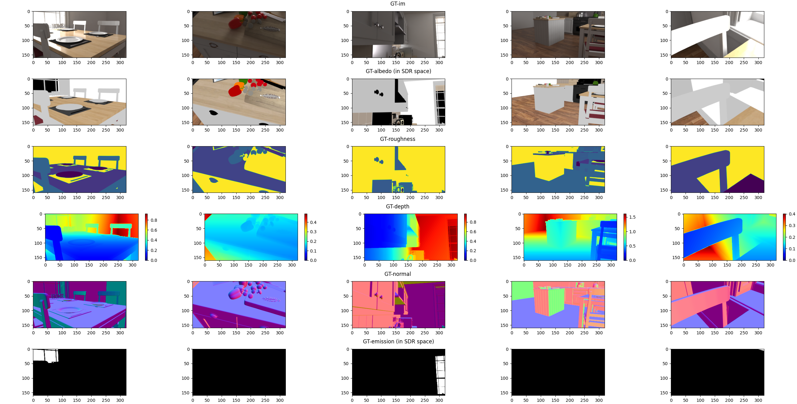

MonoSDF scenes (e.g. scannet):
``` bash
python test_class_monosdfScene3D.py --vis_2d_plt True --vis_3d_o3d False
```
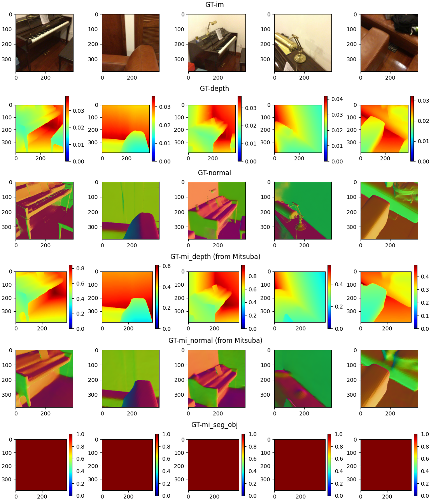

## 3D dataloader and visualizer

Note that there are two visualizer implemented: based on Matplotlib and Open3D respectively.

### Matplotlib viewer

The Matplotlib visualizer supports basic visualization of 3D properties inclucing bounding boxes and camera axes, but not meshes. 

Use ``--vis_3d_plt True`` to use the Matplotlib visualizer. The result is something like this:


The Open3D visualizer is based on Open3D, supporting meshes and more beautiful visualization. If you are on a remote machine, make sure you have a X serssion with OpenGL supported (tested with TurboVNC on Ubuntu 18). Alternatively it is recommended to run everything locally (tested on Mac and Window), with the data transferred to your local device.

**Supported modalities:** (all in global coordinates, see $X_w$-$Y_w$-$Z_w$): 

- layout # walls, ceiling and floor, as bounding box or mesh
- shapes # boxes and labels (no meshes in plt visualization)
- emitters # emitter properties (e.g. SGs approximation for windows)
- emitter_envs # emitter envmaps for (1) global envmap (2) half envmap & SG envmap of each window

Also, results from differentiable rendering by Mitsuba 3:

- mi_depth_normal # same format as depth & normal from OptixRenderer
- mi_seg # same format as seg_area, seg_env, seg_obj from OptixRenderer

Comparing depth, normal maps, and segs from mitsuba sampling VS OptixRenderer: **mitsuba does no anti-aliasing**.


(the room with 3 lamps)
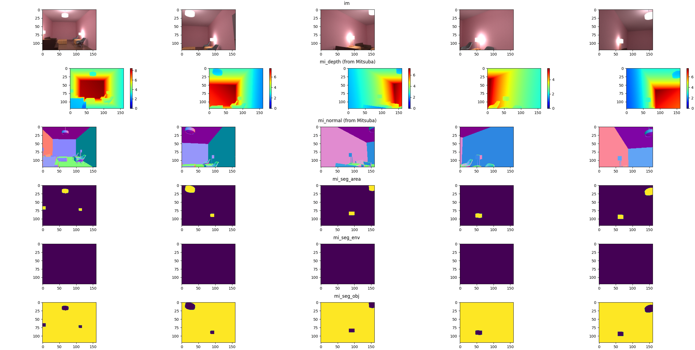
(Indoor-kitchen scene: one window and 3 oven-top lamps as area lights)
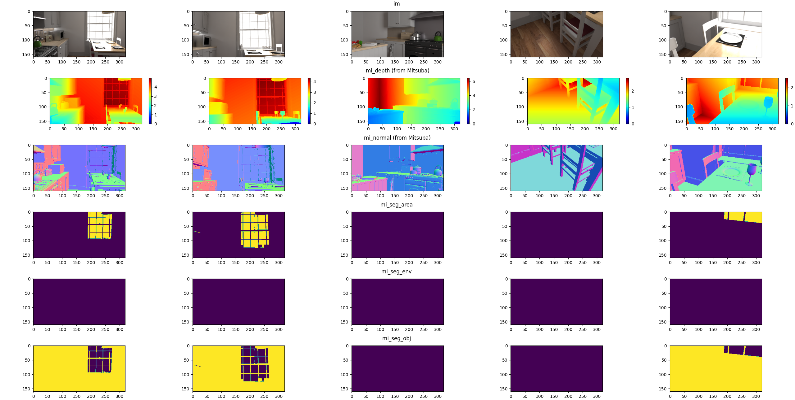

### Open3D viewer
```bash
python test_class_openroomsScene3D.py --vis_3d_o3d True
```

See the help info of the argparse arguments and comments for usage of flags.

Use ``--vis_3d_o3d True`` to use the Open3D visualizer. The result is something like this:


**Supported modalities:** 

- dense_geo # point clouds, normals, and RGB, fused from OptixRenderer renderings
- tsdf # TSDF volume, fused from depth maps
- cameras # frustums
- lighting_SG # as arrows emitted from surface points
- layout # as bbox
- shapes # bbox and meshs of shapes (objs + emitters)
- emitters # emitter properties (e.g. SGs, half envmaps)
- mi # Mitsuba sampled rays, pts, normals, acquired via Mitsuba ray-scene intersections (more accurate with no floating points)

Examples:

**dense_geo**:


**tsdf**:


**lighting_SG**:


**lighting_envmap**:
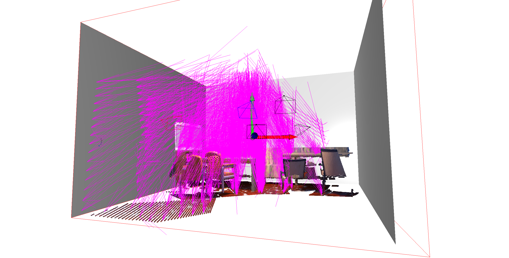

**shapes**:

(Indoor-kitchen scene: one window and 3 oven-top lamps as area lights)
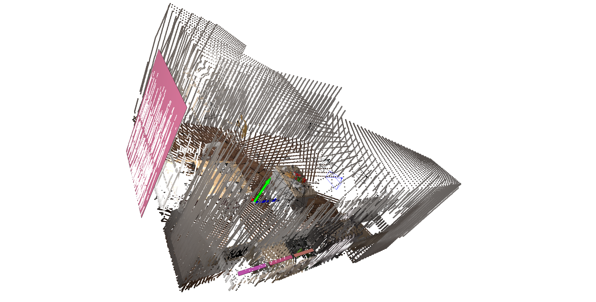

`mesh_color_type` is supported to colorize shape meshes with different sources. E.g., set `shapes_params['mesh_color_type'] = 'face_normal'`:

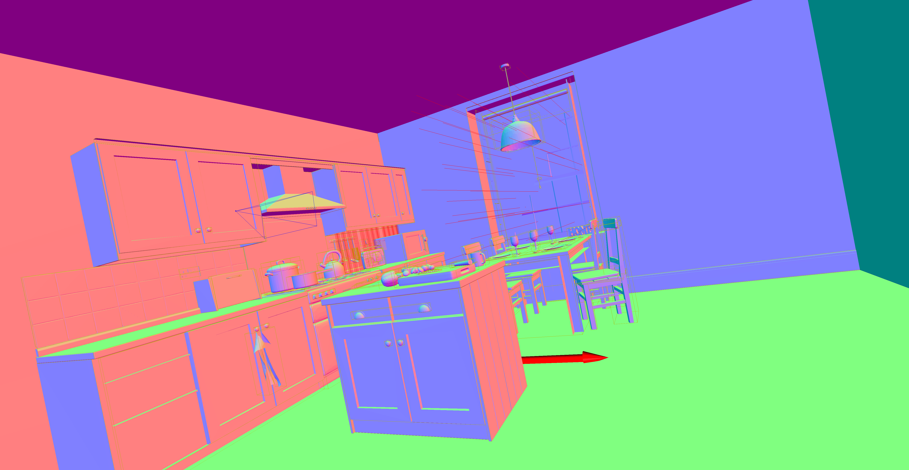

**mi**:


**Shader options**

Set ``--pcd_color_mode`` to one of 'rgb' (default), 'normal', etc., to colorize point cloud. Meanwhile set ``--if_shader=False`` so that the colors are free from Open3D shader, and visualizer runs much faster.

For example, colorize points with 3D normals:


``` bash
python test_class_openroomsScene3D.py --vis_o3d True --pcd_color_mode normal --if_shader=False
```

Or with visibility to emitter_0 (`--pcd_color_mode mi_visibility_emitter0 --if_shader=False`):


**ScanNet scenes from MonoSDF data:** (GT mesh & EST mesh)

``` bash
python test_class_monosdfScene3D.py --vis_2d_plt False --vis_3d_o3d True
```

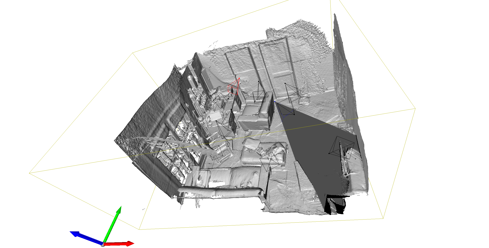
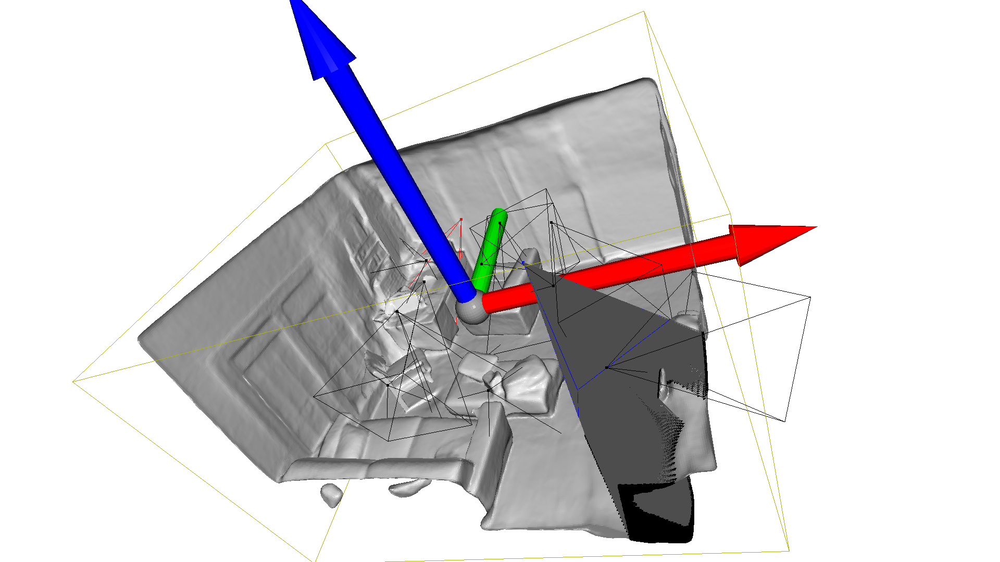

<!-- ### MonoSDF results loader

To load estimated scene from MonoSDF, into 'shape' modality and Mitsuba scene, indicate dict:

``` python
monosdf_shape_dict = {
    '_shape_normalized': 'normalized', 
    'shape_file': 'ESTmesh/*.ply', # output mesh file (in normalized space during pre-processing by MonoSDF)
    'camera_file': 'monosdf/kitchen/trainval/cameras.npz', # generated by convert_mitsubaScene3D_to_monosdf.py in pre-processing
    },  -->
```

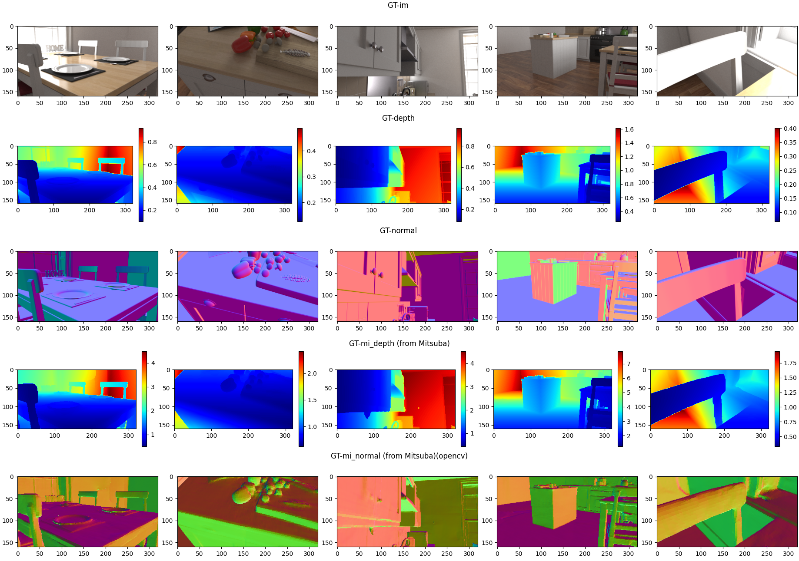

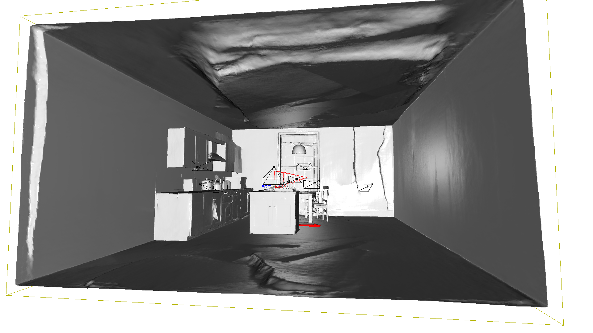

## 3D differentiable renderer

Supported 3D differentiable renderers (using GT labels):
- Full lighting renderers from ground truth lighting
  - `ZQ`: Zhengqin's surface renderer (*Li et al., 2020, Inverse Rendering for Complex Indoor Scenes*)
  - `PhySG`: PhySG surface renderer (*Zhang et al., 2021, PhySG*)
- Direct-lighting-only renderer, via importance sampling on emitter surface
  - `ZQ_emitter`: Zhengqin's emitter-based direct lighting renderer (*Li et al., 2022, Physically-Based Editing...*)

### Full lighting renderers from ground truth lighting
PhySG:

ZQ:


``` bash
PYTORCH_ENABLE_MPS_FALLBACK=1 python test_class_openroomsScene3D.py --vis_3d_o3d False --render_3d True
```

To render with **direct lighting only** using direct lighting ground truth (envmap/SGs), set `'if_direct_lighting': True`. Comparisons:

PhySG:


ZQ:


### Direct-lighting-only renderer
To render with Zhengqin's emitter-based direct lighting renderer, 

``` bash
PYTORCH_ENABLE_MPS_FALLBACK=1 python test_class_openroomsScene3D.py --vis_3d_o3d False --render_3d True --renderer_option **ZQ_emitter**
```


set ``--vis_3d_o3d True --if_set_pcd_color_mi True`` to visualize the Mistuba points colorized by either scene-lamp ray $t$ or $visibility$ (images/demo_mitsuba_ret_pts_pcd-color-mode-mi_renderer-t.png or images/demo_mitsuba_ret_pts_pcd-color-mode-mi_renderer-visibility-any.png). And set `mi_params['if_cam_rays']=True` to visualize scene-lamp rays.

Visualize scene-lamp rays for one scene point ``--if_add_rays_from_renderer True``:
``` bash
(or-py310) ➜  OpenRooms_RAW_loader git:(mm1) PYTORCH_ENABLE_MPS_FALLBACK=1 python test_class_openroomsScene3D.py --vis_3d_o3d True --render_3d True --vis_3d_plt False --if_add_rays_from_renderer --renderer_option ZQ_emitter
```


## Renderer via Mitsuba or Blender
``` bash
python test_class_mitsubaScene3D.py --render_2d --renderer mi
python test_class_mitsubaScene3D.py --render_2d --renderer blender
```

## Evaluator
### rad-MLP
Tested with repo **inv-nerf** (branch rui_emission). ```opt.eval_rad``` for evaluating rad-MLP loaded from ckpt.

[mm1 3c87ce2] added sampling rad-MLP for est emitter radiance: public_re_3_v3pose_2048 and public_re_3_v5pose_2048

``` bash
python test_class_openroomsScene3D.py --vis_3d_o3d True --eval_rad True 
```

Re-render the image from rad-MLP (via querying camera rays)
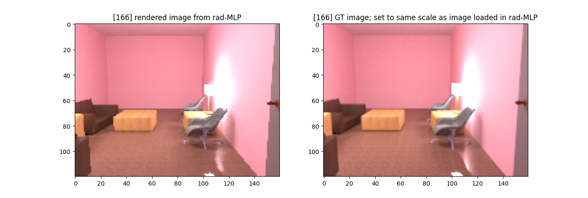
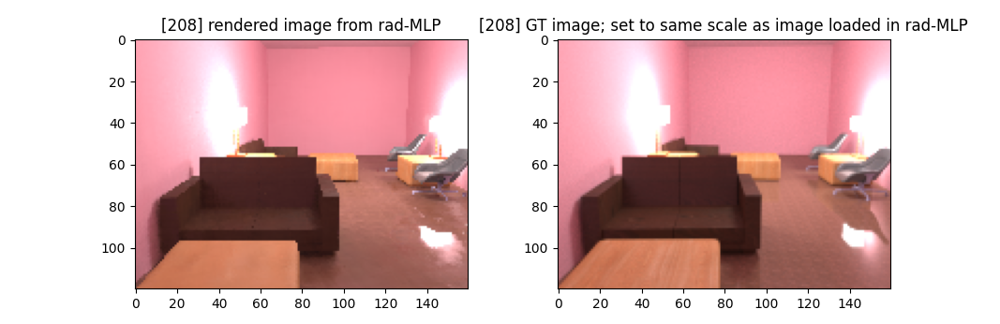
public_re_3_v5pose_2048:
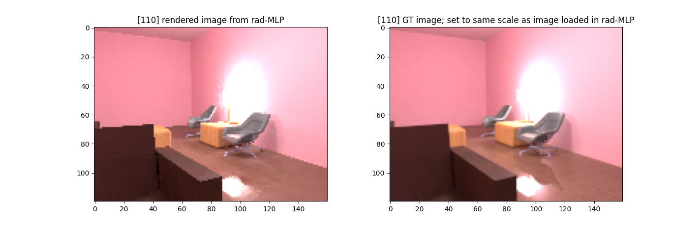

Evaluate emitter **emission**: emitter surface radiance (GT (red) and est. (blue) from querying emitter surface rays)

- enable `evaluator_rad.sample_emitter` (est in blue)
- 'emitters' in visualizer_scene_3D_o3d -> modality_list_vis (GT in red)

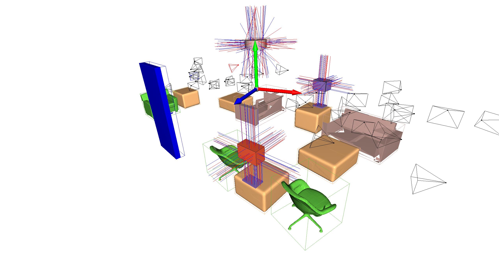
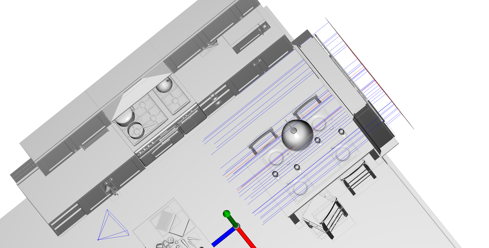
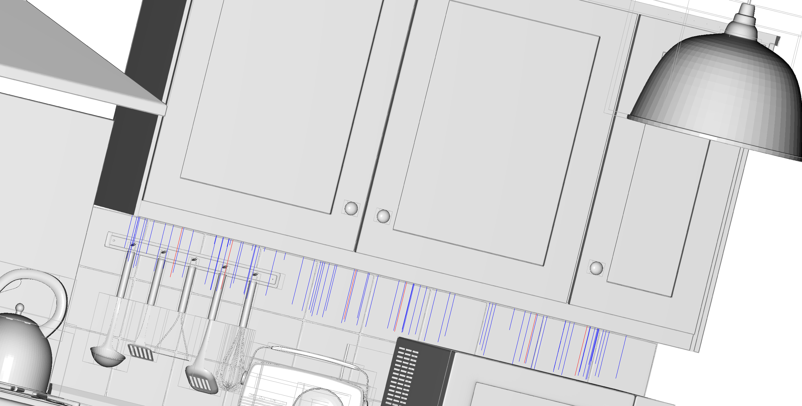

Evaluate shape per-vertex **radiance** (emission), and colorize mesh faces:

- enable `evaluator_rad.sample_shapes`
- evaluator_rad.sample_shapes(sample_type='rad', ...

Indoor-kitchen scene:
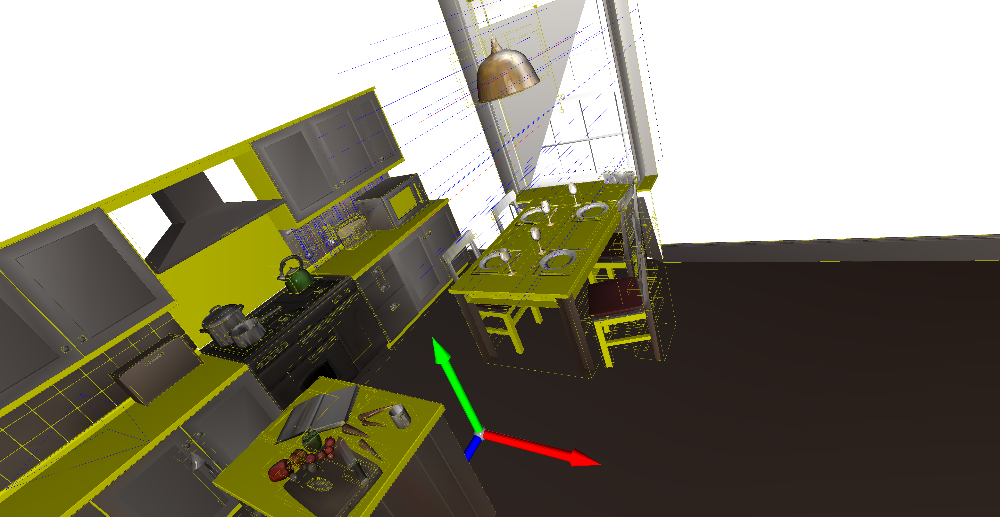

Evaluate per-pixel **incident radiance** (same idea as generating envmap in OptixRenderer):

- enable `evaluator_rad.sample_lighting(opt.rad_lighting_sample_type='emission')`

``` bash
python test_class_openroomsScene3D.py --vis_2d_plt True --eval_rad True --vis_2d_plt True --if_add_rays_from_eval True --if_add_est_from_eval True
```
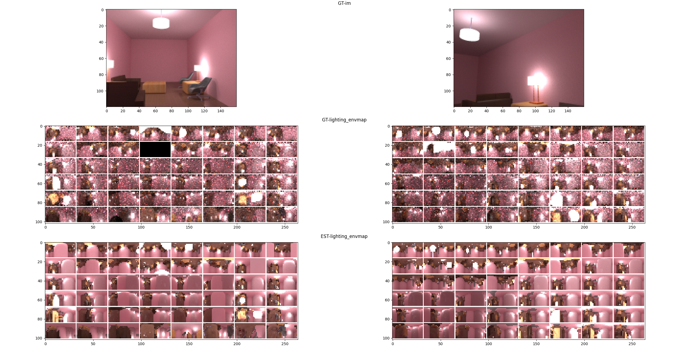

Indoor-kitchen scene:
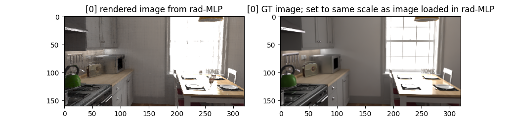
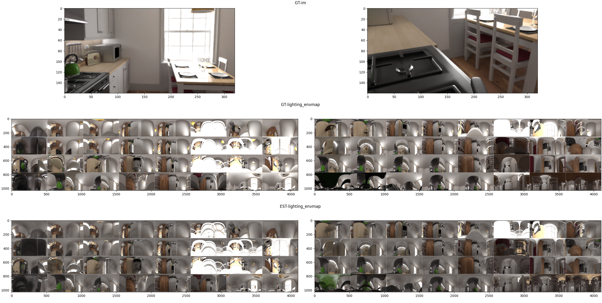
[Google Drive](https://drive.google.com/open?id=1NEBVcbFIPkra0GOWxIlOxPYXet9q38g8)

### inv-MLP
Tested with repo **inv-nerf** (branch rui_emission). ```opt.eval_inv``` for evaluating inv-MLP loaded from ckpt.

``` bash
python test_class_openroomsScene3D.py --vis_3d_o3d True --eval_inv True 
```

[mm1 579b41f] tested inv-mlp for emission mask on both scenes; fixed mesh issues + remesh

Evaluate shape per-vertex **emission mask**, and colorize mesh faces (emitter (red) and non-emitter (blue)):

- enable `evaluator_inv.sample_shapes`
  - evaluator_inv.sample_shapes(sample_type='emission_mask', ...
- 'mesh_color_type': 'eval-emission_mask', 

Openrooms-3lamps scene: ([2D vis](https://i.imgur.com/E8z7lN6.jpg))
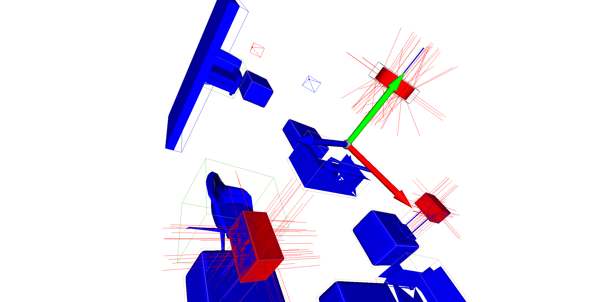
Indoor-kitchen scene: ([2D vis](https://i.imgur.com/VYF2iGU.jpg))
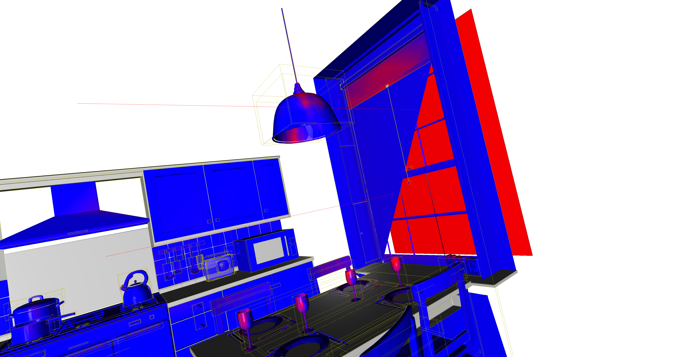
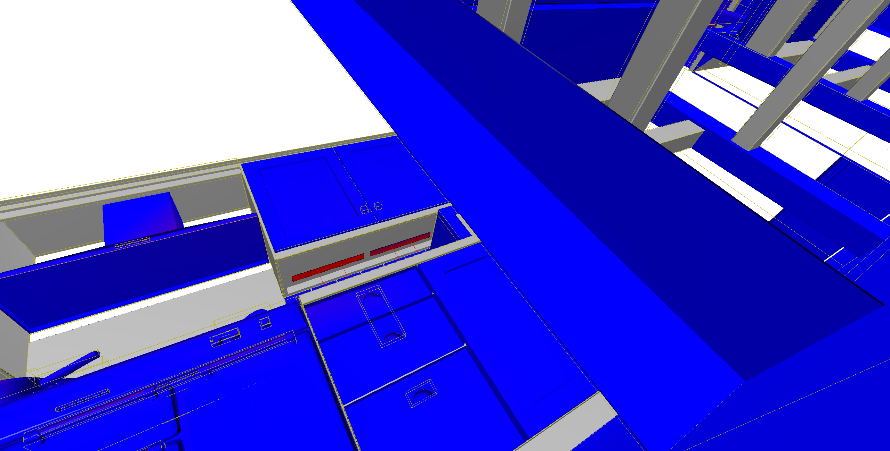

### MonoSDF
(need to run `--eval_monosdf` on a CUDA machine, then you can load the .npy file on another machine to visualize in Open3D)

``` bash
python test_class_mitsubaScene3D.py --vis_2d_plt False --vis_3d_o3d True --eval_monosdf True
```

Indoor-kitchen scene:
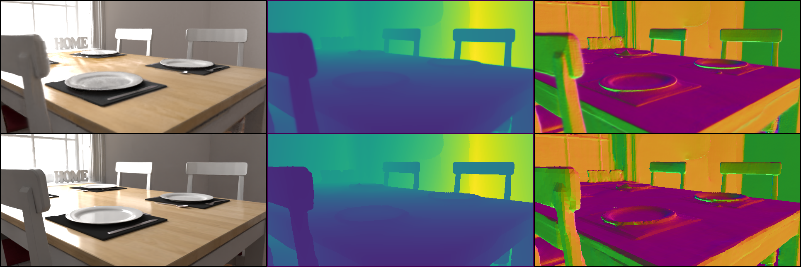


## Evaluator for scene/shape properties
### view coverage

Evaluator for view coverage:
``` bash
python test_class_mitsubaScene3D.py --vis_3d_o3d True --eval_scene True
```

[mm1 9588506] added view count: --eval_scene True

- enable `evaluator_scene.sample_shapes`
  - evaluator_scene.sample_shapes(sample_type='vis_count', ...
- 'mesh_color_type': 'eval-vis_count', 

Train:
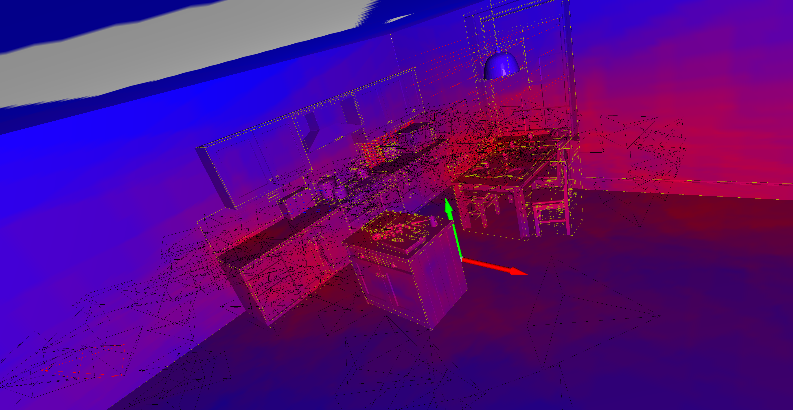
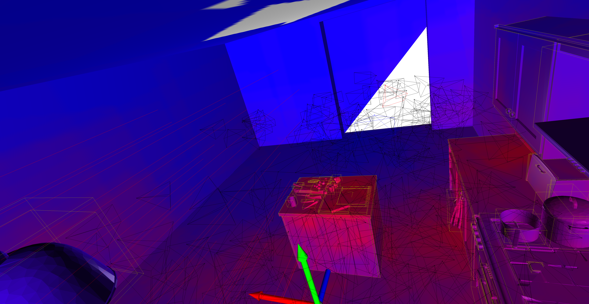
Val:


## Other utilities
### Sample camera poses for new [Mitsuba] scene

``` bash
python utils_class_mitsubaScene3D_sample_pose.py --if_sample_poses True --vis_2d_plt False --vis_3d_o3d True [--eval_scene True]
```

Set `--if_sample_poses True`. Set desired num of frames and split in two locations: `split = #SPLIT; frame_id_list = list(range(#N_FRAMES))` and `'sample_pose_num': N_FRAMES`.

Set `cam_loc_bbox` to add additional bbox for valid camera locations.

Set `'if_layout_as_walls': False` to enable/disable getting layout (walls to sample camera along) from wall meshes.

For debugging, set `sample_pose_if_vis_plt: True` to view a [bird-eye-view visualization](images/demo_sample_pose_living-room.png) of the room and sampled poses.

Change parameters in `mitsuba_scene->cam_params_dict{}` to adjust parameters in sampling camera poses (e.g. range of random yaw/pitch angles, number of samples, min distance to the wall, min/median distances of all camera rays to the scene).

**Optionally**, set `--eval_scene True` to show view [coverage visualization](images/demo_eval_scene_shapes-vis_count-train-kitchen_0.png) under current poses.


### Sample camera poses for new [Openrooms] scene

`[mm1 a823cc5] added sample poses for NEW OR scene`

Put basic scene files from original OR dataset to:
- data/public_re_3_v3pose_2048/
  - main_xml1/scene0552_00/
    - intrinsic.txt
  - scenes
    - xml1/scene0552_00
      - XML file (e.g. main.xml), transform.dat

Tested on Mac:

``` bash
python test_class_openroomsScene3D.py --vis_2d_plt False --vis_3d_o3d True --if_sample_poses True --eval_scene
```

Small normal/depth maps of sampled poses will be dumped to `data/public_re_3_v3pose_2048/main_xml1/scene0552_00/tmp_sample_poses_rendering/`

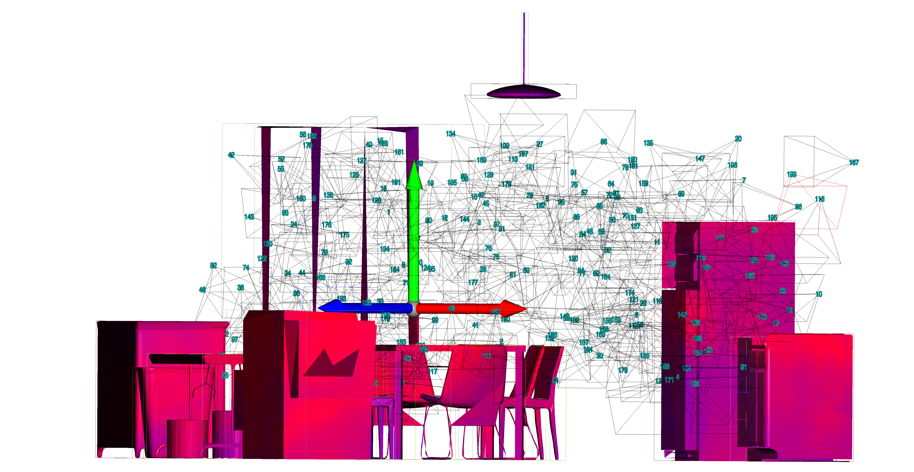

# Other datasets

Loaders for other datasets are documented at [README_data](README_data.md)

Datasets include:

- Freeviewpoint (Philip et al.'21)

# Checklist for getting started
- Install all dependencies (especially Mitsuba, Open3D (opengl-supported display required))
- Change `host` and `PATH_HOME` in the beginning of a script before running it.
- Check you have the data 

# Todolist
- [ ] bring back rendering envmaps
- [ ] extra transform -> scale, rot, trans, and corresponding functions to apply them
- [ ] load windows for Mitsuba scene
- [x] fix one camera in kitchen sceen (197)
- [ ] fix invalid_frame_id_list even when not loading poses
- [ ] eval-inv:
  - [] GT emission, albedo, roughness, metallic
- [ ] add [i2-sdf-dataset](https://github.com/jingsenzhu/i2-sdf/blob/main/DATA_CONVENTION.md)
- [x] vis envmap in 2D plt
- [ ] 1./rad* -> * rad_mul
- [ ] sort out frame_idx and frame_id: [0, 1, 2, ..., frame_num-1] VS [0, 5, 15, 200, ...] (0-based)
- [ ] change all idx to 0-based: get rid of if_1_based
- [x] compute visibility and vis for room coverage count
- [x] densely sample pts on shape surface
- [ ] make faces always 0-based acorss utils_mesh and trimesh
- [ ] change dump_OR_xml_for_mi() to be FULLY compatible with Mitsuba 3'
- [ ] renderer_blender_mitsubaScene_3D: render with multiple cameras at once
- [x] mitsubaScene3D: inhereit openroomsScene2D
- [ ] how to get **mi_rays_ret_expanded**?
- [ ] Check OptixRendererLight rays (images/demo_eval_radMLP_rample_lighting_openrooms_1.png)
- [ ] o3d: show layout bbox without meshes
- [ ] unit test scrpt without X
- [ ] batch mi ray intersection when too many frames
- [ ] multi-gpu support
- [x] vis 3D grid of unit length in o3d visualizer
- [ ] vis projection of layout+objects in visualizer_scene_2D()
- [x] vis 3D layout+objects+**camera poses** in visualizer_scene_3D_plt()
- [ ] **Interactive mode**: map keys to load/offload modalities on-the-go without having to change the flags and restart the viewer
- [ ] **Mitsuba scene**: enabling emitters and materials -> differentiable RGB rendering 
- [ ] write ``rL.forwardEnv`` to Numpy version to replace in *utils_openrooms.py*